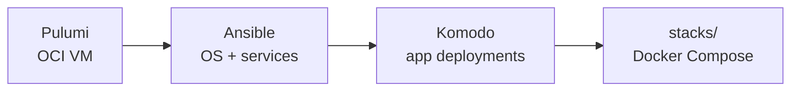

# kiran-vm

Self-hosted server infrastructure on Oracle Cloud Always Free ARM. Provisions a VM, hardens it, and runs a set of Docker apps behind Caddy — all automated from `git push`.

```
Pulumi → Ansible → Komodo → stacks/
```

- [`infra/`](./infra/README.md) — provision the VM
- [`ansible/`](./ansible/README.md) — provision the server
- [`stacks/`](./stacks/README.md) — deploy apps

---

## How it works



Traffic hits Caddy on 443, which proxies to internal app containers. All apps share a Postgres instance and Redis. Komodo manages deployments — push to `main` and GitHub Actions fires the right Komodo webhook.

## Quick start

**1. Provision the VM**
```bash
cd infra && npm install
pulumi stack init prod   # first time only
pulumi up
# note the publicIp output
```

**2. Provision the server**
```bash
cd ansible
cp secrets.yml.example secrets.yml       # fill in all values
cp inventory/hosts.ini.example inventory/hosts.ini  # paste publicIp here

ansible-playbook site.yml \
  --extra-vars "@secrets.yml" \
  --extra-vars "ansible_become_password={{ deploy_password }}"
```

**3. Set up Komodo**

Open `https://komodo.<your-domain>`. For each app:
1. Create a Stack pointing to `stacks/<name>/compose.yaml` in this repo
2. Create a Procedure with two stages: Pull Repo → Deploy Stack
3. Copy the webhook URL

**4. Add webhook secrets to GitHub**

Settings → Secrets → Actions — one secret per app: `KOMODO_WEBHOOK_<NAME>`.

**5. Push to deploy**

Any push to `stacks/<name>/` triggers the matching Komodo procedure.

---

## Common tasks

**SSH to server**
```bash
ssh -p 2222 <deploy-user>@<server-ip>
```

**Re-run a specific role**
```bash
cd ansible
ansible-playbook site.yml --extra-vars "@secrets.yml" \
  --extra-vars "ansible_become_password={{ deploy_password }}" \
  --tags caddy
```

**Redeploy an app manually** — Komodo UI → Stacks → Deploy

---

## Secrets

- `ansible/secrets.yml` — provisioning secrets, gitignored, never leave local machine
- Komodo Variables (Settings → Variables) — runtime secrets injected as `[[SECRET_NAME]]`

The n8n encryption key deserves special attention: if lost, all n8n credentials are permanently unrecoverable. Keep a copy in a password manager.
