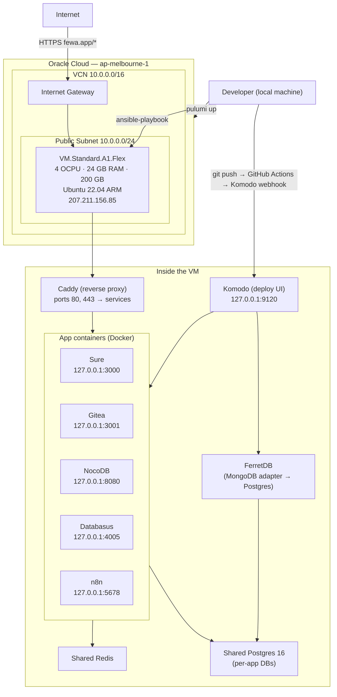
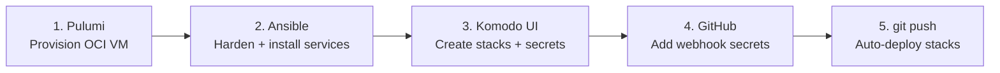

# kiran-vm

Production server infrastructure for `fewa.app` — a fully self-hosted stack running on an Oracle Cloud Always Free ARM VM.

This repo covers the entire lifecycle from cloud resource provisioning to running applications:

```
Pulumi (OCI VM) → Ansible (server hardening + services) → Komodo (app deployments) → Stacks (Docker Compose apps)
```

See the sub-directory READMEs for deep dives:
- [`infra/`](./infra/README.md) — Pulumi OCI provisioning
- [`ansible/`](./ansible/README.md) — Ansible server provisioning
- [`stacks/`](./stacks/README.md) — Komodo-managed Docker Compose stacks

---

## Architecture overview



### Domain routing

All traffic enters on ports 80/443. Caddy handles TLS (Let's Encrypt via Cloudflare DNS-01) and proxies to internal services:

| Domain | Internal address | Service |
|--------|-----------------|---------|
| `fewa.app` | — | Coming soon page |
| `komodo.fewa.app` | `127.0.0.1:9120` | Komodo deploy UI |
| `sure.fewa.app` | `127.0.0.1:3000` | Sure |
| `git.fewa.app` | `127.0.0.1:3001` | Gitea |
| `nocodb.fewa.app` | `127.0.0.1:8080` | NocoDB |
| `backup.fewa.app` | `127.0.0.1:4005` | Databasus |
| `n8n.fewa.app` | `127.0.0.1:5678` | n8n |

---

## Repository structure

```
kiran-vm/
├── infra/                             ← Pulumi — provisions OCI VM
│   ├── index.ts                       ← VCN, subnet, IGW, security list, VM
│   ├── Pulumi.yaml
│   ├── Pulumi.prod.yaml               ← prod stack config (has encrypted secrets)
│   ├── package.json
│   └── README.md
│
├── ansible/                           ← Ansible — provisions the server
│   ├── site.yml                       ← master playbook
│   ├── ansible.cfg
│   ├── group_vars/all.yml             ← all non-secret variables
│   ├── secrets.yml                    ← gitignored (copy from .example)
│   ├── secrets.yml.example            ← template with all required secret names
│   ├── inventory/hosts.ini            ← gitignored (copy from .example)
│   ├── inventory/hosts.ini.example
│   └── roles/
│       ├── common/     ← OS hardening, SSH (port 2222), iptables, fail2ban, swap, auditd
│       ├── docker/     ← Docker CE ARM64
│       ├── infra/      ← shared Postgres 16 + Redis, per-app DBs
│       ├── komodo/     ← Komodo Core + FerretDB
│       ├── caddy/      ← custom Caddy build with Cloudflare DNS plugin
│       ├── sure/
│       ├── gitea/
│       ├── nocodb/
│       ├── databasus/
│       └── n8n/
│
├── stacks/                            ← Komodo-managed Docker Compose stacks
│   ├── sure/compose.yaml
│   ├── gitea/compose.yaml
│   ├── nocodb/compose.yaml
│   ├── databasus/compose.yaml
│   └── n8n/compose.yaml
│
└── .github/workflows/
    └── deploy-stacks.yml              ← path-based selective stack deploys via Komodo webhooks
```

---

## End-to-end deployment: new server from scratch

This is the complete sequence for going from zero to a fully running server. Follow these steps in order.



### Step 1 — Provision the VM (Pulumi)

See [`infra/README.md`](./infra/README.md) for full details.

```bash
cd infra
npm install

# If starting a brand-new stack:
pulumi stack init prod

# Set OCI credentials and image OCID, then:
pulumi up
```

Note the `publicIp` output — you'll need it for Ansible inventory.

### Step 2 — Provision the server (Ansible)

See [`ansible/README.md`](./ansible/README.md) for full details.

```bash
cd ansible

# One-time setup: copy templates and fill in values
cp secrets.yml.example secrets.yml      # fill in all secrets
cp inventory/hosts.ini.example inventory/hosts.ini  # set server IP

# Run the full playbook
ansible-playbook site.yml \
  --extra-vars "@secrets.yml" \
  --extra-vars "ansible_become_password={{ deploy_password }}"
```

This installs and configures: Docker, shared Postgres + Redis, Komodo, Caddy, and all app scaffolding.

### Step 3 — Configure Komodo

Komodo is now running at `https://komodo.fewa.app`. Log in with the credentials set in `secrets.yml` (`komodo_password`).

**Add global secrets** (Settings → Variables):

These are referenced in Stack environments as `[[SECRET_NAME]]`.

| Variable name | What it is |
|--------------|-----------|
| `SHARED_POSTGRES_SURE_PASSWORD` | Postgres password for Sure |
| `SHARED_POSTGRES_GITEA_PASSWORD` | Postgres password for Gitea |
| `SHARED_POSTGRES_NOCODB_PASSWORD` | Postgres password for NocoDB |
| `SHARED_POSTGRES_N8N_PASSWORD` | Postgres password for n8n |
| `GITEA_SECRET_KEY` | Gitea secret key |
| `SURE_SECRET_KEY_BASE` | Sure Rails secret |
| `OPENAI_ACCESS_TOKEN` | OpenAI API key |
| `NOCODB_JWT_SECRET` | NocoDB JWT secret |
| `DATABASUS_SECRET_KEY` | Databasus secret |
| `R2_ACCESS_KEY_ID` | Cloudflare R2 access key |
| `R2_SECRET_ACCESS_KEY` | Cloudflare R2 secret |
| `N8N_ENCRYPTION_KEY` | **Critical** — losing this loses all n8n credentials |

**Create a Stack** for each app:

1. Komodo → Stacks → New Stack
2. Name: `sure` (or `gitea`, `nocodb`, etc.)
3. Set Git repo: this repo, path `stacks/<name>/compose.yaml`
4. Set Stack Environment for any variables not in Komodo Variables (see [`stacks/README.md`](./stacks/README.md))
5. Deploy the stack manually once to verify it works

**Create a Procedure** for each stack:

1. Komodo → Procedures → New Procedure
2. Add two stages: `Pull Repo` (pulls this git repo) + `Deploy Stack` (deploys the stack)
3. Copy the webhook URL — you'll need it in Step 4

### Step 4 — Add webhook secrets to GitHub

In this repo's GitHub settings → Secrets:

| Secret name | Value |
|------------|-------|
| `KOMODO_WEBHOOK_SURE` | Komodo procedure webhook URL for sure |
| `KOMODO_WEBHOOK_GITEA` | Komodo procedure webhook URL for gitea |
| `KOMODO_WEBHOOK_NOCODB` | Komodo procedure webhook URL for nocodb |
| `KOMODO_WEBHOOK_DATABASUS` | Komodo procedure webhook URL for databasus |
| `KOMODO_WEBHOOK_N8N` | Komodo procedure webhook URL for n8n |

### Step 5 — Push to deploy

From this point on, any push to `main` that touches `stacks/<name>/` will automatically:
1. Trigger GitHub Actions (`.github/workflows/deploy-stacks.yml`)
2. Detect which stack(s) changed
3. Fire the matching Komodo procedure webhook
4. Komodo pulls the repo and redeploys the stack

---

## Day-to-day operations

### Redeploy a specific app

Push a change to `stacks/<name>/compose.yaml` — GitHub Actions handles the rest.

Or manually in Komodo UI: Stacks → select stack → Deploy.

### Run a specific Ansible role

```bash
cd ansible
ansible-playbook site.yml \
  --extra-vars "@secrets.yml" \
  --extra-vars "ansible_become_password={{ deploy_password }}" \
  --tags caddy
```

Available tags: `common`, `hardening`, `docker`, `infra`, `services`, `komodo`, `caddy`, `sure`, `gitea`, `nocodb`, `databasus`, `n8n`

### SSH to the server

```bash
ssh -p 2222 deploy@207.211.156.85
```

### Adding a new app

1. Create `stacks/<name>/compose.yaml` — use the `infra_net` external network, bind port to `127.0.0.1:<port>`
2. Add a Caddy vhost in `ansible/roles/caddy/templates/Caddyfile.j2`
3. If it needs Postgres: add a user + DB to `ansible/roles/infra/templates/init.sql.j2`
4. Add an Ansible role in `ansible/roles/<name>/` with at minimum a tasks/main.yml
5. Add the role to `ansible/site.yml`
6. Run Ansible: `--tags infra,caddy,<name>`
7. In Komodo: create Stack + Procedure, copy webhook URL
8. Add `KOMODO_WEBHOOK_<NAME>` secret to GitHub
9. Add filter entry to `.github/workflows/deploy-stacks.yml`

---

## Secrets management

Two categories of secrets:

**Ansible secrets** (`ansible/secrets.yml`, gitignored):
Used during provisioning only. Never leave the local machine. Copy from `secrets.yml.example` and fill in.

**Runtime secrets** (Komodo → Settings → Variables):
Used by running containers. Referenced in `compose.yaml` as `[[SECRET_NAME]]`. Never committed to git.

**n8n encryption key** — special case. If this key is lost, all n8n credential data becomes unrecoverable. Store it somewhere safe (password manager) in addition to Komodo Variables.

---

## Portability

This repo is parameterised for reuse. To provision for a different project:

1. In `infra/`: `pulumi stack init <newname>`, set config for new OCI tenancy/region
2. In `ansible/group_vars/all.yml`: change `domain` and `timezone`
3. Create fresh `ansible/secrets.yml` and `ansible/inventory/hosts.ini`
4. Run Pulumi + Ansible + Komodo setup as above

The only thing tied to `fewa.app` is the Caddyfile template and `group_vars/all.yml`. Everything else is generic.
