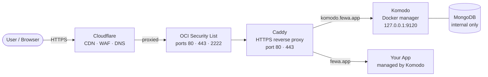
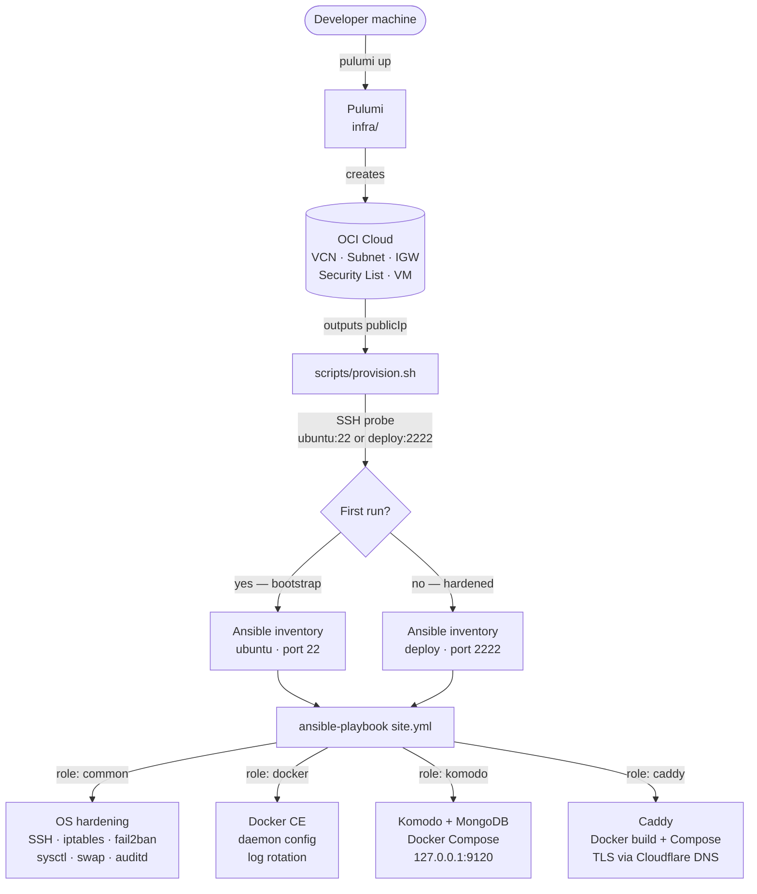
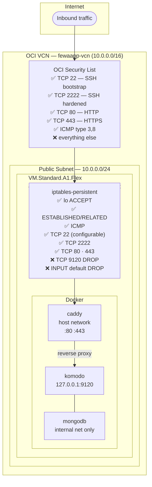
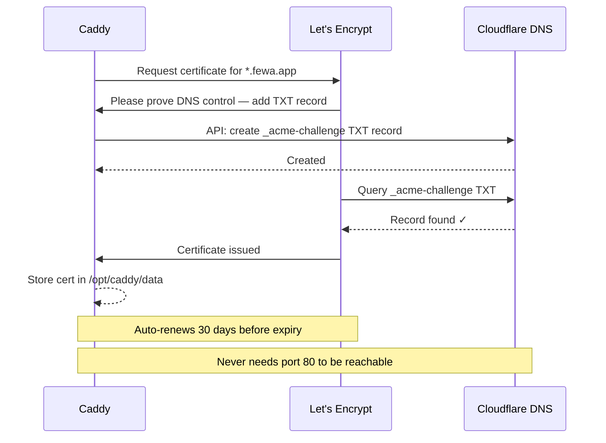
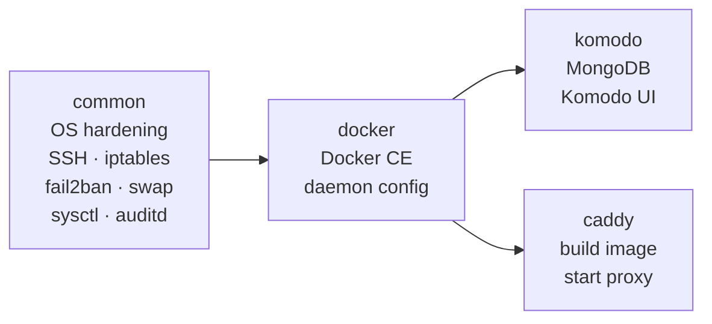
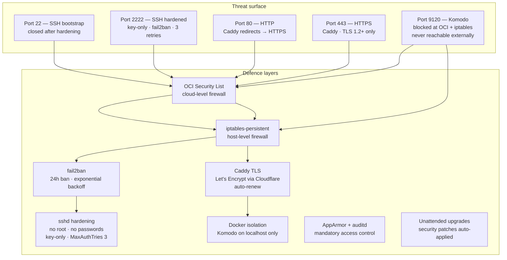
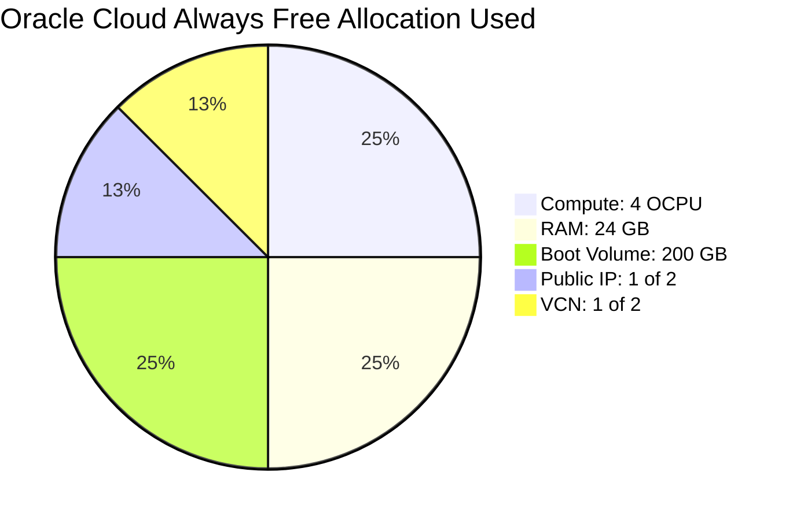

# kiran-vm — fewa.app Production Server

Oracle Cloud Always Free infrastructure + automated server provisioning for `fewa.app`.

Two tools, strict separation of concerns:

- **Pulumi** (`infra/`) — creates cloud resources: network, compute, firewall rules
- **Ansible** (`ansible/`) — configures the server: OS hardening, Docker, Komodo, Caddy

---

## Architecture Overview

### High-Level: Internet to Application



### Deployment Pipeline



### Network & Firewall Layers



### TLS Certificate Flow (Cloudflare DNS Challenge)



### Role Dependency Order



---

## Directory Structure

```
kiran-vm/
├── README.md                          ← you are here
├── sample.tf                          ← OCI reference (do not modify)
│
├── infra/                             ← Pulumi (cloud infra only)
│   ├── index.ts                       ← VCN, subnet, IGW, security list, VM
│   ├── Pulumi.yaml                    ← project metadata
│   ├── Pulumi.prod.yaml               ← stack config (non-secret)
│   ├── package.json
│   ├── tsconfig.json
│   └── README.md                      ← infra-specific docs
│
├── ansible/                           ← Ansible (server software only)
│   ├── site.yml                       ← master playbook (4 roles)
│   ├── ansible.cfg                    ← SSH config, pipelining
│   ├── requirements.yml               ← Galaxy collections
│   ├── secrets.yml.example            ← ← template for secrets (commit this)
│   ├── secrets.yml                    ← ← real secrets (NEVER commit)
│   ├── .gitignore
│   ├── inventory/
│   │   ├── hosts.ini                  ← generated by provision.sh (gitignored)
│   │   └── hosts.ini.example          ← format reference
│   ├── group_vars/
│   │   └── all.yml                    ← non-secret variables
│   └── roles/
│       ├── common/                    ← OS hardening
│       ├── docker/                    ← Docker CE
│       ├── komodo/                    ← Komodo + MongoDB
│       └── caddy/                     ← Caddy reverse proxy
│
└── scripts/
    └── provision.sh                   ← glue: pulumi → inventory → ansible
```

---

## What Each Component Does

### Pulumi (`infra/`)

Creates **only** Oracle Cloud resources. Touches nothing on the server:

| Resource | Details |
|---|---|
| VCN | `fewaapp-vcn`, CIDR `10.0.0.0/16` |
| Internet Gateway | `fewaapp-igw` |
| Route Table | Default route `0.0.0.0/0` → IGW |
| Security List | Ingress: 22, 2222, 80, 443, ICMP. Egress: all |
| Public Subnet | `10.0.0.0/24`, DNS label `public` |
| Compute Instance | `VM.Standard.A1.Flex`, 4 OCPU, 24 GB RAM |
| Boot Volume | 200 GB, Balanced (`vpusPerGb=20`) |
| Public IP | Ephemeral, assigned to primary VNIC |

### Ansible Roles

| Role | What it does |
|---|---|
| `common` | Creates `deploy` user, hardens SSH (port 2222, key-only), configures iptables-persistent, installs fail2ban, sets sysctl, creates 2 GB swap, enables auditd + AppArmor, installs unattended-upgrades |
| `docker` | Installs Docker CE from Docker's official ARM64 repo, configures `/etc/docker/daemon.json` (log rotation, live-restore), adds `deploy` to docker group |
| `komodo` | Deploys MongoDB + Komodo via Docker Compose to `/opt/komodo`, binds Komodo to `127.0.0.1:9120`, never exposed directly |
| `caddy` | Builds a custom Caddy image with the Cloudflare DNS plugin (using `xcaddy`), deploys via Docker Compose to `/opt/caddy`, obtains TLS certs via Cloudflare DNS challenge |

---

## Prerequisites

### 1. Pulumi CLI

```bash
curl -fsSL https://get.pulumi.com | sh
# verify
pulumi version
```

### 2. Node.js 20+

```bash
# via nvm (recommended)
nvm install 20 && nvm use 20
node --version   # should be v20.x
```

### 3. Ansible + collections

```bash
# macOS
brew install ansible

# or via pip
pip3 install --user ansible

ansible --version   # should be 2.15+
```

### 4. OCI API Key

Pulumi needs an OCI API key to call the Oracle Cloud API.

**In OCI Console:**

1. Top-right → Profile → **My profile**
2. Left sidebar → **API keys** → **Add API key**
3. Choose **Generate API key pair**
4. Download the **private key** (`.pem` file)
5. Click **Add** — copy the config snippet shown (you need tenancy OCID, user OCID, fingerprint)

```bash
mkdir -p ~/.oci
mv ~/Downloads/private-key.pem ~/.oci/oci_api_key.pem
chmod 600 ~/.oci/oci_api_key.pem
```

### 5. SSH key pair

```bash
# Check if you already have one
ls ~/.ssh/id_ed25519.pub

# Generate if needed
ssh-keygen -t ed25519 -f ~/.ssh/id_ed25519 -C "your_email@example.com"
```

### 6. Cloudflare API Token

Caddy uses Cloudflare's DNS API to issue TLS certificates (DNS-01 ACME challenge). This means HTTPS works even before any DNS record points to the server.

1. Go to [dash.cloudflare.com/profile/api-tokens](https://dash.cloudflare.com/profile/api-tokens)
2. Click **Create Token**
3. Use template **Edit zone DNS**
4. Under **Zone Resources** → select: **Specific zone** → `fewa.app`
5. Click **Continue to summary** → **Create Token**
6. **Copy the token now** — it is shown only once

---

## Step-by-Step Deployment

### Step 1 — Set up Cloudflare DNS (placeholder IP)

Before you have a server IP, create DNS records with a placeholder. Cloudflare will proxy them so the real IP doesn't matter yet.

In your Cloudflare dashboard for `fewa.app`:

| Type | Name | Content | Proxy status |
|---|---|---|---|
| A | `fewa.app` | `1.2.3.4` (placeholder) | Proxied (orange cloud) |
| A | `komodo` | `1.2.3.4` (placeholder) | Proxied (orange cloud) |

You will update these to the real IP in Step 3.

### Step 2 — Deploy infrastructure with Pulumi

```bash
cd infra
npm install
```

Create the stack:

```bash
pulumi stack init prod
```

Configure OCI credentials:

```bash
# Region
pulumi config set oci:region "ap-melbourne-1"

# OCI API credentials (all marked --secret so they're encrypted in state)
pulumi config set oci:tenancyOcid "ocid1.tenancy.oc1..aaaaaaaaozcyhvji72e4uy765e5wciim3jnbmbmcqdtxq4hng47ltfy6giyq" --secret
pulumi config set oci:userOcid    "ocid1.user.oc1..<your-user-ocid>" --secret
pulumi config set oci:fingerprint "<xx:xx:xx:xx:...>" --secret

# Private key — the .pem file content, as a single-line value
pulumi config set oci:privateKey "$(cat ~/.oci/oci_api_key.pem)" --secret

# SSH public key to inject into the instance
pulumi config set sshPublicKey "$(cat ~/.ssh/id_ed25519.pub)"
```

Preview what Pulumi will create:

```bash
pulumi preview --stack prod
```

Expected output:
```
+ oracle_cloud_infrastructure:core/vcn:Vcn                   fewaapp-vcn      create
+ oracle_cloud_infrastructure:core/internetGateway:InternetGateway fewaapp-igw create
+ oracle_cloud_infrastructure:core/routeTable:RouteTable      fewaapp-rt       create
+ oracle_cloud_infrastructure:core/securityList:SecurityList  fewaapp-sl       create
+ oracle_cloud_infrastructure:core/subnet:Subnet              fewaapp-subnet   create
+ oracle_cloud_infrastructure:core/instance:Instance          fewaapp-vm       create
```

Deploy:

```bash
pulumi up --stack prod
```

> This takes 3–5 minutes. Oracle Cloud provisions the VM and waits for it to boot.

Check outputs:

```bash
pulumi stack output publicIp    # → e.g. 161.33.67.234
pulumi stack output sshCommand  # → ssh -p 2222 deploy@161.33.67.234
```

### Step 3 — Update Cloudflare DNS to real IP

Take the `publicIp` from Step 2 and update your DNS records:

| Type | Name | Content |
|---|---|---|
| A | `fewa.app` | `161.33.67.234` (your real IP) |
| A | `komodo` | `161.33.67.234` (your real IP) |

Leave proxy status as **Proxied** (orange cloud).

### Step 4 — Prepare Ansible secrets

```bash
cd ../ansible
cp secrets.yml.example secrets.yml
```

Open `secrets.yml` and fill in every value:

```bash
# Generate strong secrets
openssl rand -hex 32    # for komodo_passkey and komodo_webhook_secret
openssl rand -base64 32 # for passwords

# Get your SSH public key
cat ~/.ssh/id_ed25519.pub
```

`secrets.yml` fields:

| Field | What it is | How to generate |
|---|---|---|
| `deploy_ssh_public_key` | SSH public key injected into the server | `cat ~/.ssh/id_ed25519.pub` |
| `deploy_password` | sudo password for the `deploy` user | `openssl rand -base64 32` |
| `mongo_password` | MongoDB root password (internal) | `openssl rand -base64 32` |
| `komodo_password` | Komodo admin login password | `openssl rand -base64 32` |
| `komodo_passkey` | Komodo API authentication token | `openssl rand -hex 32` |
| `komodo_webhook_secret` | Komodo webhook validation secret | `openssl rand -hex 32` |
| `cloudflare_api_token` | Cloudflare DNS API token for TLS | From Step 1 (Cloudflare dashboard) |

> `secrets.yml` is gitignored and never leaves your machine.
> Optional: encrypt it with `ansible-vault encrypt secrets.yml` for added protection.

### Step 5 — Run the provisioner

From the repo root:

```bash
./scripts/provision.sh
```

The script does the following automatically:

```
1. reads publicIp from Pulumi stack 'prod'
2. SSH probe → ubuntu@<IP>:22
   └─ success → bootstrap mode (ubuntu / port 22)
   └─ fail    → hardened mode (deploy / port 2222)
3. writes ansible/inventory/hosts.ini
4. installs Ansible Galaxy collections
5. runs: ansible-playbook site.yml --extra-vars @secrets.yml
```

**First run** (fresh instance, ~10–15 minutes):

The `common` role:
- Creates the `deploy` user with sudo rights
- Injects your SSH public key into `deploy`'s `authorized_keys`
- Changes SSH port from 22 to 2222
- Hardens sshd (no root login, no passwords, key-only)
- Configures iptables rules (deployed to `/etc/iptables/rules.v4`)
- Installs and configures fail2ban
- Applies sysctl hardening
- Creates 2 GB swap
- Enables auditd and AppArmor
- Configures unattended security upgrades
- Reboots if a kernel was upgraded

The `docker` role:
- Installs Docker CE from Docker's official ARM64 apt repository
- Deploys `/etc/docker/daemon.json` (log rotation, live-restore)
- Adds `deploy` to the `docker` group

The `komodo` role:
- Creates `/opt/komodo/`
- Deploys `docker-compose.yaml` and `.env`
- Starts MongoDB (mongo:7.0) and Komodo (v1.17) containers

The `caddy` role:
- Creates `/opt/caddy/`
- Deploys `Dockerfile` (builds Caddy + Cloudflare DNS plugin)
- Deploys `Caddyfile` and `.env`
- Builds the Caddy image locally and starts the container
- Caddy obtains TLS certificates via Cloudflare DNS challenge

**Subsequent runs** (idempotent, ~2–3 minutes):
- All tasks check current state before making changes
- Only changed items are applied
- Caddy config changes trigger `caddy reload` (zero downtime)

### Step 6 — Verify the deployment

```bash
# SSH into the server
ssh -p 2222 deploy@<your-ip>

# Check all containers are running
docker ps

# Expected output:
# komodo_mongo_1   mongo:7.0         Up (healthy)
# komodo_komodo_1  ghcr.io/moghtech/komodo:v1.17   Up
# caddy_caddy_1    caddy:2-custom    Up

# Check Caddy logs (TLS certificate acquisition)
cd /opt/caddy && docker compose logs -f

# Check Komodo logs
cd /opt/komodo && docker compose logs -f
```

Open in browser:

| URL | What you see |
|---|---|
| `https://komodo.fewa.app` | Komodo admin login |
| `https://fewa.app` | "fewa.app — coming soon" |

Log in to Komodo:
- Username: `fewaadmin` (set in `group_vars/all.yml`)
- Password: value of `komodo_password` from your `secrets.yml`

### Step 7 — Close port 22 (post-hardening)

After confirming you can SSH on port 2222 and Komodo is accessible, close the bootstrap SSH port:

**In `ansible/group_vars/all.yml`:**

```yaml
ssh_allow_port_22: false   # was: true
```

Re-run the provisioner:

```bash
./scripts/provision.sh
```

This updates `/etc/iptables/rules.v4` and runs `netfilter-persistent reload` to drop port 22 at the OS level.

> Port 22 remains in the **OCI Security List** (Pulumi-managed) but is now blocked by iptables at the host level. To remove it from the OCI Security List too, remove the port 22 ingress rule from `infra/index.ts` and run `pulumi up`.

---

## Day-to-Day Operations

### SSH access

```bash
ssh -p 2222 deploy@<server-ip>

# Or use the Pulumi output:
$(cd infra && pulumi stack output sshCommand)
```

### Deploying applications

Use the Komodo UI at `https://komodo.fewa.app` to:
- Create Docker Compose stacks
- Manage deployments and restarts
- View container logs

### Adding a new subdomain

1. Create an A record in Cloudflare: `myapp.fewa.app` → your server IP

2. Add a block to `/opt/caddy/Caddyfile` on the server:

```caddyfile
myapp.fewa.app {
  tls {
    dns cloudflare {env.CLOUDFLARE_API_TOKEN}
  }
  encode gzip
  reverse_proxy 127.0.0.1:<your-app-port>
}
```

3. Reload Caddy (zero downtime):

```bash
cd /opt/caddy
docker compose exec caddy caddy reload --config /etc/caddy/Caddyfile
```

Or re-run `./scripts/provision.sh --tags caddy` to apply via Ansible.

### Re-running only specific roles

```bash
# Run only the caddy role
ANSIBLE_TAGS=caddy ./scripts/provision.sh

# Run only komodo
ANSIBLE_TAGS=komodo ./scripts/provision.sh

# Run common + docker
ANSIBLE_TAGS=common,docker ./scripts/provision.sh
```

### Updating Komodo version

1. Edit `ansible/group_vars/all.yml`:
   ```yaml
   komodo_image: "ghcr.io/moghtech/komodo:v1.18"  # new version
   ```
2. Re-run:
   ```bash
   ANSIBLE_TAGS=komodo ./scripts/provision.sh
   ```

### Updating Caddy or the Cloudflare DNS plugin

The Caddy image is built locally from `Dockerfile.j2`. To rebuild with a newer Caddy version:

1. Edit `ansible/roles/caddy/templates/Dockerfile.j2`:
   ```dockerfile
   FROM caddy:2.9-builder AS builder   # pin new version
   ```
2. Re-run:
   ```bash
   ANSIBLE_TAGS=caddy ./scripts/provision.sh
   ```

### Viewing logs

```bash
# Caddy (access + TLS)
cd /opt/caddy && docker compose logs -f

# Komodo
cd /opt/komodo && docker compose logs -f komodo

# MongoDB
cd /opt/komodo && docker compose logs -f mongo

# iptables rules
sudo iptables -L INPUT -n -v --line-numbers

# fail2ban status
sudo fail2ban-client status sshd

# Unattended upgrades history
cat /var/log/unattended-upgrades/unattended-upgrades.log
```

### Checking security

```bash
# Active firewall rules
sudo iptables -L -n -v

# Banned IPs
sudo fail2ban-client status sshd

# AppArmor status
sudo aa-status

# Listening ports (verify nothing unexpected)
sudo ss -tlnp

# Docker containers
docker ps --format "table {{.Names}}\t{{.Image}}\t{{.Status}}\t{{.Ports}}"
```

---

## Security Model



| Layer | Tool | What it blocks |
|---|---|---|
| Cloud firewall | OCI Security List | All ports except 22, 2222, 80, 443 — dropped before reaching VM |
| Host firewall | iptables-persistent | Same rules at OS level; port 9120 explicitly dropped |
| Brute-force protection | fail2ban | 3 failed SSH attempts → 24h IP ban, exponential backoff |
| SSH hardening | sshd_config | No root login, no passwords, key-only, port 2222 |
| TLS | Caddy + Let's Encrypt | Automatic HTTPS, auto-renew, Cloudflare DNS challenge |
| Container isolation | Docker | Komodo bound to `127.0.0.1` — unreachable from outside host |
| Kernel hardening | sysctl | SYN cookies, martian logging, redirect blocking, ASLR |
| Mandatory access | AppArmor | Process confinement |
| Audit trail | auditd | Syscall logging |
| Patch management | unattended-upgrades | Security patches applied automatically |

---

## Resource Usage (Always Free Tier)



| Resource | Used | Always Free Limit |
|---|---|---|
| VM.Standard.A1.Flex OCPU | 4 | 4 total |
| VM.Standard.A1.Flex RAM | 24 GB | 24 GB total |
| Block storage | 200 GB | 200 GB total |
| Public IPs | 1 | 2 |
| VCNs | 1 | 2 |
| Egress bandwidth | Pay-as-you-go | 10 TB/month free |

> The Always Free tier is perpetual — these resources never expire as long as your account remains active.

---

## Troubleshooting

### `provision.sh` fails: "Could not get publicIp from Pulumi stack"

```bash
# Check the stack exists and has been deployed
cd infra
pulumi stack ls
pulumi stack select prod
pulumi stack output

# If stack is empty, run pulumi up first
pulumi up --stack prod
```

### SSH connection refused on first run

The OCI instance takes 2–3 minutes after `pulumi up` to fully boot and start sshd.

```bash
# Test manually
ssh -p 22 ubuntu@<ip> -o ConnectTimeout=5

# If still failing after 5 minutes, check OCI Console:
# Compute → Instances → fewaapp-vm → Console Connection
```

### Ansible "UNREACHABLE" after hardening

If the server was already hardened (port moved to 2222, user is `deploy`) but `provision.sh` is probing the wrong port:

```bash
# Force hardened mode by testing connectivity manually
ssh -p 2222 deploy@<ip> -i ~/.ssh/id_ed25519

# If that works, provision.sh should detect it automatically on next run
./scripts/provision.sh
```

### Caddy TLS certificate fails

```bash
# SSH in and check Caddy logs
ssh -p 2222 deploy@<ip>
cd /opt/caddy && docker compose logs caddy | grep -i "error\|acme\|cert"
```

Common causes:
- Cloudflare API token doesn't have "Edit zone DNS" permission for `fewa.app`
- DNS records not updated to the server's real IP
- Cloudflare TTL hasn't propagated yet (wait 5 minutes)

```bash
# Verify the token works
curl -X GET "https://api.cloudflare.com/client/v4/zones" \
  -H "Authorization: Bearer <your-token>" | jq '.result[].name'
```

### Komodo not accessible at `komodo.fewa.app`

```bash
ssh -p 2222 deploy@<ip>

# Check containers
docker ps

# Check Komodo is listening on localhost only
ss -tlnp | grep 9120

# Check Caddy config
cd /opt/caddy && docker compose exec caddy caddy validate --config /etc/caddy/Caddyfile
```

### Host key verification failure (after instance rebuild)

If you destroyed and recreated the instance (same IP, new host key):

```bash
# Remove the old known_hosts entry
ssh-keygen -R "[<ip>]:22"
ssh-keygen -R "[<ip>]:2222"

# provision.sh uses StrictHostKeyChecking=accept-new
# so the new key will be accepted automatically
./scripts/provision.sh
```

### fail2ban locked you out

If you accidentally triggered fail2ban from your own IP:

1. Use the **OCI Console** → **Compute** → **fewaapp-vm** → **Console Connection** to get a serial console
2. Or use OCI Cloud Shell (browser-based)
3. Once in: `sudo fail2ban-client set sshd unbanip <your-ip>`

---

## Secrets Reference

All secrets live in `ansible/secrets.yml` (gitignored). Use `ansible/secrets.yml.example` as the template.

```bash
cp ansible/secrets.yml.example ansible/secrets.yml
```

| Secret | Where used | How to generate |
|---|---|---|
| `deploy_ssh_public_key` | Injected into `~deploy/.ssh/authorized_keys` | `cat ~/.ssh/id_ed25519.pub` |
| `deploy_password` | `deploy` user sudo password | `openssl rand -base64 32` |
| `mongo_password` | MongoDB root password + Komodo DB connection | `openssl rand -base64 32` |
| `komodo_password` | Komodo web UI login | `openssl rand -base64 32` |
| `komodo_passkey` | Komodo API authentication | `openssl rand -hex 32` |
| `komodo_webhook_secret` | Komodo webhook validation | `openssl rand -hex 32` |
| `cloudflare_api_token` | Caddy DNS-01 ACME challenge | Cloudflare dashboard → API Tokens |

Secrets are passed to Ansible via:
```bash
ansible-playbook site.yml --extra-vars "@ansible/secrets.yml"
```

They are never written to Pulumi state, never logged, and never committed to git.

---

## Destroying the Infrastructure

> **Warning:** `preserveBootVolume: false` means destroying the stack **permanently deletes** all data on the boot volume, including MongoDB data and TLS certificates. Back up anything important first.

```bash
# Back up Komodo data (optional)
ssh -p 2222 deploy@<ip> "tar czf /tmp/komodo-backup.tar.gz /opt/komodo/mongodb"
scp -P 2222 deploy@<ip>:/tmp/komodo-backup.tar.gz ./komodo-backup.tar.gz

# Destroy all OCI resources
cd infra
pulumi destroy --stack prod
```

This removes: VM, boot volume, subnet, security list, route table, IGW, VCN, and public IP.

---

## Configuration Reference

### Non-secret variables (`ansible/group_vars/all.yml`)

| Variable | Default | Description |
|---|---|---|
| `deploy_user` | `deploy` | System user that runs Docker |
| `ssh_port` | `2222` | SSH port after hardening |
| `ssh_allow_port_22` | `true` | Set `false` after confirming 2222 works |
| `timezone` | `UTC` | Server timezone |
| `domain` | `fewa.app` | Primary domain |
| `komodo_subdomain` | `komodo.fewa.app` | Komodo admin URL |
| `komodo_port` | `9120` | Komodo internal port (never public) |
| `komodo_image` | `ghcr.io/moghtech/komodo:v1.17` | Komodo container image |
| `komodo_init_admin_username` | `fewaadmin` | Komodo admin username |
| `mongo_image` | `mongo:7.0` | MongoDB container image |
| `mongo_username` | `komodo` | MongoDB database user |
| `caddy_email` | `admin@fewa.app` | Email for Let's Encrypt notifications |
| `komodo_dir` | `/opt/komodo` | Komodo data directory on server |
| `caddy_dir` | `/opt/caddy` | Caddy data directory on server |

### Pulumi stack config (`infra/Pulumi.prod.yaml`)

| Config key | Required | Description |
|---|---|---|
| `oci:region` | yes | `ap-melbourne-1` |
| `oci:tenancyOcid` | yes (secret) | OCI tenancy OCID |
| `oci:userOcid` | yes (secret) | OCI user OCID |
| `oci:fingerprint` | yes (secret) | API key fingerprint |
| `oci:privateKey` | yes (secret) | OCI API private key PEM content |
| `sshPublicKey` | yes | SSH public key for instance metadata |
| `compartmentId` | no | Defaults to tenancy OCID |
| `imageOcid` | no | Defaults to Ubuntu 22.04 ARM Melbourne |

---

## On-Server File Layout

```
/opt/komodo/
├── docker-compose.yaml
├── .env                    ← secrets (chmod 600, owned by deploy)
└── mongodb/                ← MongoDB data files (persisted on boot volume)

/opt/caddy/
├── Dockerfile              ← custom Caddy + Cloudflare DNS plugin
├── docker-compose.yaml
├── Caddyfile               ← reverse proxy config
├── .env                    ← CLOUDFLARE_API_TOKEN (chmod 600)
├── data/                   ← TLS certificates (Let's Encrypt)
└── config/                 ← Caddy config cache

/etc/iptables/
└── rules.v4                ← firewall rules (managed by Ansible)

/etc/docker/
└── daemon.json             ← log rotation, live-restore

/etc/ssh/
└── sshd_config             ← hardened SSH config (managed by Ansible)
```
