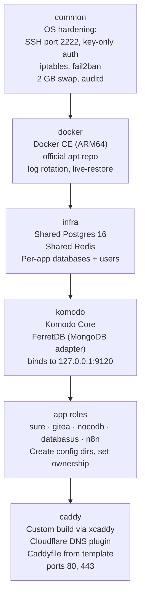

# ansible/

Ansible playbook that provisions the server after Pulumi has created the VM. Installs and configures Docker, shared Postgres + Redis, Komodo, Caddy, and scaffolding for each application.

## What it does



## Prerequisites

- Ansible 2.13+ installed locally (`pip install ansible`)
- The VM is running and accessible (public IP from Pulumi output)
- SSH private key at `~/.ssh/id_ed25519` (or update `ansible.cfg`)

## One-time local setup

```bash
cd ansible

# Create inventory — set the server's public IP
cp inventory/hosts.ini.example inventory/hosts.ini
# Edit: replace <SERVER_IP> with actual IP from pulumi stack output

# Create secrets file — fill in all values
cp secrets.yml.example secrets.yml
# Edit: fill every field (see Secrets reference below)

# Optional: verify connectivity
ansible all -m ping --extra-vars "@secrets.yml"
```

## Running the playbook

### Full provisioning (new server)

```bash
ansible-playbook site.yml \
  --extra-vars "@secrets.yml" \
  --extra-vars "ansible_become_password={{ deploy_password }}"
```

The first run bootstraps from root using the OCI default user, then all subsequent connections use the `deploy` user. This is handled automatically.

### Re-run a specific role

Use tags to target specific roles:

```bash
ansible-playbook site.yml \
  --extra-vars "@secrets.yml" \
  --extra-vars "ansible_become_password={{ deploy_password }}" \
  --tags caddy
```

### Run multiple tags

```bash
--tags "infra,n8n,caddy"
```

## Roles and tags

| Role | Tags | What it does |
|------|------|-------------|
| `common` | `common`, `hardening` | Creates `deploy` user, disables root SSH, moves SSH to port 2222, key-only auth, iptables rules, fail2ban, sysctl hardening, 2 GB swap file, auditd, AppArmor, unattended-upgrades |
| `docker` | `docker` | Installs Docker CE from official apt repo (ARM64), configures daemon with log rotation and live-restore |
| `infra` | `infra`, `services` | Runs shared Postgres 16 and Redis containers, creates per-app databases and users via `init.sql.j2` |
| `komodo` | `komodo`, `services` | Runs Komodo Core + FerretDB (a MongoDB-compatible adapter backed by postgres-documentdb). Binds to `127.0.0.1:9120`. |
| `sure` | `sure`, `services` | Creates config directories and sets ownership |
| `gitea` | `gitea`, `services` | Creates config directories, sets ownership. Gitea runs rootless on port 3001, SSH on port 2223. |
| `nocodb` | `nocodb`, `services` | Creates config directories and sets ownership |
| `databasus` | `databasus`, `services` | Creates config directories and sets ownership |
| `n8n` | `n8n`, `services` | Creates `/opt/n8n` with correct ownership |
| `caddy` | `caddy`, `services` | Builds custom Caddy binary via xcaddy (includes Cloudflare DNS plugin), writes Caddyfile from template, starts Caddy as a systemd service |

> The `services` tag targets all service roles at once: `infra`, `komodo`, `sure`, `gitea`, `nocodb`, `databasus`, `n8n`, `caddy`

## Variables

### group_vars/all.yml (non-secret)

Safe to commit. Edit to change domain, timezone, ports, or other non-sensitive settings.

| Variable | Value | Description |
|----------|-------|-------------|
| `domain` | `fewa.app` | Base domain for all subdomains |
| `timezone` | `Asia/Kathmandu` | Server and app timezone |
| `deploy_user` | `deploy` | Non-root user for SSH and app ownership |
| `ssh_port` | `2222` | SSH port (moved away from 22) |
| `caddy_port_http` | `80` | Caddy HTTP port |
| `caddy_port_https` | `443` | Caddy HTTPS port |
| `shared_postgres_host` | `127.0.0.1` | Postgres bind address |
| `shared_postgres_port` | `5432` | Postgres port |
| `shared_postgres_user` | `postgres` | Postgres superuser |
| `shared_postgres_db` | `postgres` | Postgres default DB |
| `sure_port` | `3000` | Sure internal port |
| `gitea_port` | `3001` | Gitea web internal port |
| `gitea_ssh_port` | `2223` | Gitea SSH port |
| `nocodb_port` | `8080` | NocoDB internal port |
| `databasus_port` | `4005` | Databasus internal port |
| `n8n_port` | `5678` | n8n internal port |
| `komodo_port` | `9120` | Komodo internal port |

### secrets.yml (gitignored)

Copy from `secrets.yml.example` and fill in all values. Don't commit this file.

| Variable | Description |
|----------|-------------|
| `deploy_ssh_public_key` | SSH public key to add to `deploy` user's `authorized_keys` |
| `deploy_password` | Password for `deploy` user (used for sudo, not SSH login) |
| `ferretdb_postgres_password` | Password for Komodo's internal FerretDB Postgres database |
| `komodo_jwt_secret` | JWT signing secret for Komodo (generate with `openssl rand -hex 32`) |
| `komodo_password` | Admin password for Komodo UI |
| `komodo_passkey` | Komodo API passkey |
| `komodo_webhook_secret` | Shared secret for Komodo webhook validation |
| `cloudflare_api_token` | Cloudflare API token with Zone:DNS Edit permission (for ACME DNS-01) |
| `shared_postgres_password` | Password for the Postgres superuser |
| `shared_postgres_sure_password` | Postgres password for Sure's database |
| `shared_postgres_gitea_password` | Postgres password for Gitea's database |
| `shared_postgres_nocodb_password` | Postgres password for NocoDB's database |
| `shared_postgres_n8n_password` | Postgres password for n8n's database |
| `gitea_secret_key` | Gitea's internal secret key |
| `sure_secret_key_base` | Rails secret key base for Sure |
| `openai_access_token` | OpenAI API key (used by Sure) |
| `nocodb_jwt_secret` | NocoDB JWT secret |
| `databasus_secret_key` | Databasus secret key |
| `r2_access_key_id` | Cloudflare R2 access key ID (for Databasus backups) |
| `r2_secret_access_key` | Cloudflare R2 secret access key |

### inventory/hosts.ini (gitignored)

```ini
[servers]
207.211.156.85  ansible_user=deploy  ansible_port=2222  ansible_ssh_private_key_file=~/.ssh/id_ed25519
```

Copy from `inventory/hosts.ini.example` and replace the IP with the VM's public IP from `pulumi stack output`.

## Caddy and TLS

Caddy is built from source using [xcaddy](https://github.com/caddyserver/xcaddy) with the Cloudflare DNS plugin. This enables **DNS-01 ACME challenges**, which don't require port 80 to be reachable and work for wildcard certificates. The `cloudflare_api_token` secret is used for DNS validation.

The Caddyfile is rendered from `roles/caddy/templates/Caddyfile.j2`. All domains and ports come from `group_vars/all.yml`. Security headers and gzip compression are applied globally.

To update routing (e.g. add a new app), edit `Caddyfile.j2` and re-run with `--tags caddy`.

## Shared Postgres

All apps share a single Postgres 16 container. Each app gets its own database and user, created by `roles/infra/templates/init.sql.j2` on first run.

To create a new app's database manually:

```bash
ssh -p 2222 deploy@207.211.156.85
docker exec -it shared-postgres psql -U postgres
CREATE USER myapp WITH PASSWORD '...';
CREATE DATABASE myapp OWNER myapp;
```

## Komodo and FerretDB

Komodo requires MongoDB. Rather than running MongoDB (which has ARM complications), this setup uses **FerretDB** — a MongoDB-compatible API adapter backed by the `postgres-documentdb` extension. Komodo sees a standard MongoDB connection string and has no idea FerretDB is involved.

## Adding a new app

1. Create `ansible/roles/<name>/tasks/main.yml` — at minimum, create `/opt/<name>` with correct ownership
2. Add any secrets to `secrets.yml.example` (and your `secrets.yml`)
3. Add any non-secret variables to `group_vars/all.yml`
4. Add a vhost block to `roles/caddy/templates/Caddyfile.j2`
5. If using Postgres: add `CREATE USER` / `CREATE DATABASE` to `roles/infra/templates/init.sql.j2`
6. Add the role to `site.yml` (before `caddy` in the order)
7. Run: `ansible-playbook site.yml --extra-vars "@secrets.yml" --extra-vars "ansible_become_password={{ deploy_password }}" --tags "infra,caddy,<name>"`

## Troubleshooting

**"Permission denied" on first run**
The playbook handles this automatically — the `common` role creates the `deploy` user if it doesn't exist yet. Run the full playbook as-is.

**SSH connection refused on port 2222**
SSH is on port 2222 after the `common` role runs. Before that, use port 22. After, use 2222.

**Caddy fails to get a certificate**
Check that `cloudflare_api_token` has `Zone:DNS:Edit` permission. Check Caddy service logs: `sudo journalctl -u caddy -f`

**Komodo UI unreachable**
Check Komodo is running: `docker ps | grep komodo`. Check Caddy is proxying correctly: `sudo caddy validate --config /etc/caddy/Caddyfile`
