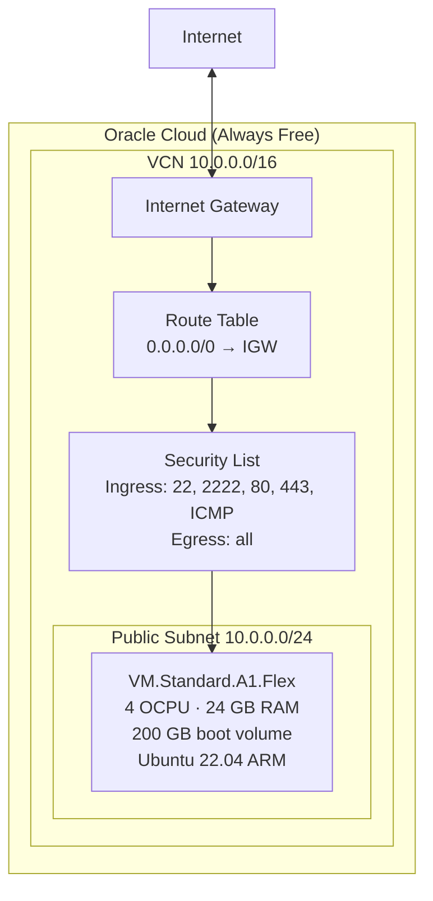

# infra/

Pulumi TypeScript program that provisions an Oracle Cloud **Always Free** ARM VM — VCN, subnet, security list, internet gateway, and a `VM.Standard.A1.Flex` compute instance (4 OCPU, 24 GB RAM, 200 GB boot volume).

Portable by design: change a handful of config values to provision for a completely different project or OCI account.

## Architecture



## Prerequisites

- [Pulumi CLI](https://www.pulumi.com/docs/get-started/install/) installed
- An Oracle Cloud account with Always Free quota
- OCI API key generated (`~/.oci/oci_api_key.pem`)
- Node.js 18+

## First-time setup

```bash
cd infra
npm install

# Create a new stack (e.g. prod)
pulumi stack init prod

# OCI credentials (stored encrypted in Pulumi state)
pulumi config set           oci:region      ap-melbourne-1   # your OCI region
pulumi config set --secret  oci:tenancyOcid <your-tenancy-ocid>
pulumi config set --secret  oci:userOcid    <your-user-ocid>
pulumi config set --secret  oci:fingerprint <your-key-fingerprint>
pulumi config set --secret  oci:privateKey  "$(cat ~/.oci/oci_api_key.pem)"

# SSH public key (placed in instance metadata for cloud-init)
pulumi config set sshPublicKey "$(cat ~/.ssh/id_ed25519.pub)"

# imageOcid: Ubuntu 22.04 Minimal ARM — find yours at:
# https://docs.oracle.com/en-us/iaas/images/
pulumi config set imageOcid ocid1.image.oc1.ap-melbourne-1.aaaaaaaajdpuyfkddhhlmhyvv3yylwxkw7oo7ftze4a3yiijh7g3jzxasfkq
```

## Deploy

```bash
pulumi up
```

Pulumi will print the public IP and SSH command on success:

```
Outputs:
  publicIp   : "207.x.x.x"
  sshCommand : "ssh -p 2222 deploy@207.x.x.x"
```

Copy `publicIp` into `ansible/inventory/hosts.ini` and run Ansible to complete provisioning.

## Using for a different project

To provision a fresh VM for another product:

1. `pulumi stack init <newproject>`
2. Set all config values above (different tenancy, region, or just a new stack)
3. Change `projectName` if you want different OCI resource name prefixes:
   ```bash
   pulumi config set projectName my-other-project
   ```
4. `pulumi up`

## Teardown

```bash
pulumi destroy
```

## Config reference

| Key | Required | Default | Description |
|-----|----------|---------|-------------|
| `oci:region` | yes | — | OCI region identifier |
| `oci:tenancyOcid` | yes (secret) | — | OCI tenancy OCID |
| `oci:userOcid` | yes (secret) | — | OCI user OCID |
| `oci:fingerprint` | yes (secret) | — | API key fingerprint |
| `oci:privateKey` | yes (secret) | — | OCI API private key PEM |
| `sshPublicKey` | yes | — | SSH public key for the VM |
| `imageOcid` | yes | Melbourne Ubuntu 22.04 | OS image OCID (region-specific) |
| `projectName` | no | `kiran-vm` | Prefix for all OCI resource names |
| `compartmentId` | no | `tenancyOcid` | OCI compartment (defaults to root) |

## Outputs

| Output | Description |
|--------|-------------|
| `publicIp` | VM public IP address |
| `sshCommand` | Ready-to-use SSH command |
| `vcnId` | VCN OCID |
| `subnetId` | Subnet OCID |
