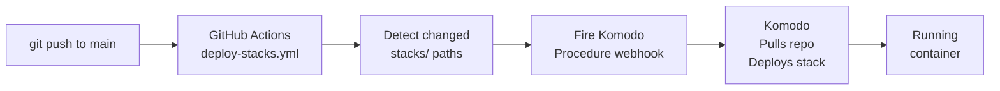

# stacks/

Docker Compose files for all applications, managed by [Komodo](https://komo.do). Each subdirectory is an independent stack deployed and updated via Komodo.

Ansible handles OS-level provisioning (directories, users, shared services). Komodo handles everything at the container level: pulling images, injecting secrets, and deploying stacks.

## How deployments work



GitHub Actions detects which `stacks/<name>/` directories changed and fires only the matching Komodo procedure webhook(s). Unrelated stacks are not touched.

## Stacks

| Stack | Domain | Internal port | Image |
|-------|--------|--------------|-------|
| `sure` | `sure.fewa.app` | `3000` | Rails app |
| `gitea` | `git.fewa.app` | `3001` (web), `2223` (SSH) | Gitea |
| `nocodb` | `nocodb.fewa.app` | `8080` | NocoDB |
| `databasus` | `backup.fewa.app` | `4005` | Databasus |
| `n8n` | `n8n.fewa.app` | `5678` | n8n |

All stacks bind to `127.0.0.1:<port>` — never exposed directly to the internet. Caddy reverse-proxies them.

All stacks join the `infra_net` Docker network to reach shared Postgres and Redis.

## Secrets and environment variables

Runtime secrets come from **Komodo Variables** (Settings → Variables in Komodo UI), not from files or environment. They are injected into `compose.yaml` using the `[[SECRET_NAME]]` syntax.

> Variables set in Komodo are never stored in this git repo. They live only in Komodo's database (backed by FerretDB → Postgres).

### How to add a secret

1. Komodo UI → Settings → Variables → New Variable
2. Set name and value (mark as secret if sensitive)
3. Reference in `compose.yaml` as `[[VARIABLE_NAME]]`
4. Redeploy the stack

### Stack-specific environment variables

Some variables are set per-stack in **Komodo Stack Environment** (not global Variables). These appear directly in the stack's Environment tab in the Komodo UI.

## n8n stack

n8n has a few special considerations.

### Compose file: `stacks/n8n/compose.yaml`

Uses the `infra_net` network to reach Postgres. Postgres credentials come from Komodo Variables.

### Environment variables

These must be set in **Komodo Stack Environment** (not Komodo Variables) for the n8n stack:

| Variable | Example value | Notes |
|----------|--------------|-------|
| `N8N_HOST` | `n8n.fewa.app` | Hostname n8n uses in links |
| `N8N_WEBHOOK_URL` | `https://n8n.fewa.app` | Full URL for webhooks |
| `N8N_TZ` | `Asia/Kathmandu` | Timezone (renamed from `TZ` — Komodo blocks `TZ` as a reserved name) |

> **Important**: Use `N8N_TZ`, not `TZ`. Komodo treats `TZ` as a reserved environment variable and silently ignores it, causing n8n to run in UTC regardless of the value.

### n8n encryption key

`N8N_ENCRYPTION_KEY` must be set in **Komodo Variables** (global, marked as secret):

```
Name:  N8N_ENCRYPTION_KEY
Value: <random 32+ character string>
```

Then referenced in the n8n compose.yaml as `[[N8N_ENCRYPTION_KEY]]`.

**This key is critical.** n8n uses it to encrypt all stored credentials (API keys, passwords, etc.). If the key is lost:
- All stored n8n credentials become permanently unrecoverable
- You would need to re-enter every credential in every workflow

**Store it in a password manager** in addition to Komodo Variables.

## Setting up a new stack in Komodo

### 1. Create the Stack

Komodo UI → Stacks → New Stack

| Field | Value |
|-------|-------|
| Name | `sure` (match directory name) |
| Git provider | GitHub |
| Repository | `yourusername/kiran-vm` |
| Branch | `main` |
| Compose file path | `stacks/sure/compose.yaml` |

### 2. Add variables to Stack Environment

Set any stack-specific variables (like n8n's `N8N_HOST`) in the Stack's Environment tab.

### 3. Add global secrets to Komodo Variables

Settings → Variables → New Variable for any secrets referenced with `[[SECRET_NAME]]`.

### 4. Create a Procedure

Komodo UI → Procedures → New Procedure

Add two stages:

**Stage 1: Pull repo**
- Action: `Pull Repo`
- Target: the stack's linked repo

**Stage 2: Deploy stack**
- Action: `Deploy Stack`
- Target: the stack name

Save and copy the webhook URL.

### 5. Add webhook to GitHub

GitHub repo → Settings → Secrets and variables → Actions:

| Secret name | Value |
|------------|-------|
| `KOMODO_WEBHOOK_SURE` | Komodo procedure webhook URL |
| `KOMODO_WEBHOOK_N8N` | Komodo procedure webhook URL for n8n |
| etc. | |

### 6. Update GitHub Actions workflow

In `.github/workflows/deploy-stacks.yml`, add a detection rule for the new stack path and fire the new webhook.

## Docker network

All stacks connect to `infra_net`, which is created by the `infra` Ansible role (shared Postgres + Redis container). It is defined as external in each `compose.yaml`:

```yaml
networks:
  infra_net:
    external: true
```

This lets app containers reach Postgres at `shared-postgres:5432` and Redis at `shared-redis:6379` by container name.

## Adding a new stack

1. Create `stacks/<name>/compose.yaml`:
   - Bind to `127.0.0.1:<port>` (choose an unused port)
   - Join `infra_net` if it needs Postgres/Redis
   - Reference secrets as `[[SECRET_NAME]]`

2. Add Caddy vhost in `ansible/roles/caddy/templates/Caddyfile.j2`:
   ```
   <name>.fewa.app {
     reverse_proxy 127.0.0.1:<port>
   }
   ```

3. Re-run Ansible caddy role: `--tags caddy`

4. In Komodo: create Stack + Procedure, copy webhook URL

5. Add `KOMODO_WEBHOOK_<NAME>` secret to GitHub

6. Update `.github/workflows/deploy-stacks.yml` to include the new stack path

## Troubleshooting

**Stack shows as failed in Komodo**
Check container logs in Komodo UI (Stacks → stack name → Logs), or on the server:
```bash
docker logs <container-name>
```

**`[[SECRET_NAME]]` not substituted / shows literally**
The variable name must exist in Komodo Variables exactly as referenced. Check Settings → Variables for typos.

**n8n workflows run at wrong time (UTC instead of local timezone)**
Ensure `N8N_TZ` (not `TZ`) is set in the n8n Stack Environment. Komodo silently ignores `TZ`.

**Container can't reach Postgres**
Verify the container is on `infra_net`:
```bash
docker network inspect infra_net
```
Verify the `networks` block in `compose.yaml` declares `infra_net` as external.

**Webhook not firing**
Check GitHub Actions logs. Verify the `KOMODO_WEBHOOK_*` secret is set and the path filter in `deploy-stacks.yml` matches the changed file.
